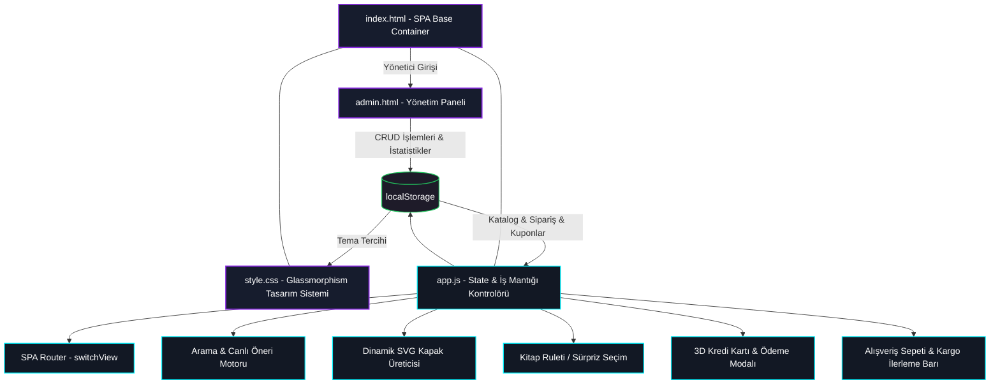

# 📖 TellaKitap — Modern, Premium & Sıra Dışı Dijital Kitabevi

<p align="center">
  
</p>

<p align="center">
  
  
  
  
  
</p>

---

### 🌟 Proje Tanımı
**TellaKitap**, modern web arayüz standartlarının (HTML5, CSS3, ES6+ Javascript) en üst sınırlarını sergilemek amacıyla, **hiçbir harici kütüphane veya çatı (React, Vue, Tailwind, Bootstrap vb.) kullanılmadan sıfırdan geliştirilmiş** premium bir online kitap satış platformudur. 

Estetik detayları işlevsellikle harmanlayan bu vitrin projesi; cam efekti (**glassmorphism**), pürüzsüz donanım hızlandırmalı sayfa geçişleri, 3D CSS dönüşümleri içeren ödeme simülasyonları, tamamen entegre aydınlık/karanlık tema motoru ve mobil çentik uyumlu alt navigasyon barı ile modern bir web uygulamasının sunabileceği en yüksek kullanıcı deneyimini (**UX/UI**) hedefler.

---

## 🚀 Canlı Önizleme (Live Demo)
Projeyi tarayıcınızda anında test etmek, tüm animasyonları ve işlevleri deneyimlemek için:
👉 **[TellaKitap Canlı Demo Bağlantısı](https://vahitkeskin.github.io/TellaKitap/)**

---

## 🗺️ Uygulama Mimari Yapısı (Architecture Diagram)

Uygulamanın Tek Sayfa Uygulama (SPA) yönlendirmesi, durum (state) yönetimi, yerel depolama entegrasyonu ve dinamik bileşenlerinin akışı aşağıdaki şemada modellenmiştir:



---

## 🎨 Tasarım Sistemi ve Renk Kültürü

TellaKitap, **HSL (Hue, Saturation, Lightness)** renk modeli üzerinde inşa edilmiş, hem aydınlık hem de karanlık modlarda mükemmel kontrast oranları (WCAG standartları) sunan dinamik bir tasarım diline sahiptir.

| Renk Değişkeni | Karanlık Mod (Varsayılan) | Aydınlık Mod (Sıcak Kağıt) | CSS Değişkeni | Tasarım Alanı |
| :--- | :--- | :--- | :--- | :--- |
| **Arka Plan (App BG)** | `hsl(224, 25%, 8%)` | `hsl(36, 30%, 96%)` | `--bg-app` | Ana uygulama zemin tonu |
| **Cam Panel Yüzeyi** | `rgba(22, 28, 45, 0.65)` | `rgba(255, 255, 255, 0.7)` | `--bg-surface` | Glassmorphic kartlar ve barlar |
| **Katı Yüzey** | `hsl(224, 25%, 12%)` | `hsl(36, 20%, 92%)` | `--bg-surface-solid` | Modal iç alanları, buton zeminleri |
| **Birincil Vurgu (Neon Mor)** | `hsl(265, 85%, 64%)` | `hsl(265, 85%, 55%)` | `--accent-color` | Butonlar, aktif dotlar ve logolar |
| **İkincil Vurgu (Turkuaz)** | `hsl(190, 90%, 50%)` | `hsl(190, 90%, 42%)` | `--accent-secondary` | Fiyat indirimleri, sayaçlar, spotlight |
| **Birincil Metin** | `hsl(0, 0%, 95%)` | `hsl(224, 25%, 12%)` | `--text-primary` | Okuma başlıkları ve paragraf metinleri |

> [!TIP]
> **Glassmorphism CSS Reçetesi:**
> Uygulamadaki cam efektleri, GPU destekli `backdrop-filter` ve hafif bir sınır (`border-color`) konturu ile birleştirilerek derinlik algısını maksimize eder:
> ```css
> background: var(--bg-surface);
> backdrop-filter: blur(20px) saturate(180%);
> -webkit-backdrop-filter: blur(20px) saturate(180%);
> border: 1px solid var(--border-color);
> ```

---

## ⚡ Gelişmiş Özellikler ve Algoritmalar

### 💳 1. 3D Kredi Kartı Mockup ve Çift Yönlü Flip (Arayüz & Animasyon)
Ödeme sayfasına geçildiğinde, tamamen saf CSS ve JavaScript ile kontrol edilen üç boyutlu bir kredi kartı görünümü kullanıcıyı karşılar.
*   **Kart Sahibi Veri Senkronizasyonu:** Kullanıcı kart numarası, isim ve son kullanma tarihi alanlarına giriş yaptıkça, kart üzerindeki sanal kabartma yazılar anlık olarak güncellenir.
*   **180 Derece Eksen Rotasyonu (3D Flip):** Kullanıcı Güvenlik Kodu (CVV) giriş alanına odaklandığı anda, kredi kartı pürüzsüz bir `transform: rotateY(180deg)` animasyonuyla arkasını döner. CVV alanından çıkıldığında ise kart tekrar ön yüzüne geri döner.

```javascript
// CVV Focus animasyonu tetikleme mantığı
cvvInput.addEventListener('focus', () => {
    creditCardInner.style.transform = 'rotateY(180deg)';
});
cvvInput.addEventListener('blur', () => {
    creditCardInner.style.transform = 'rotateY(0deg)';
});
```

### 🔮 2. "Sürpriz Kitap Seç" (Kitap Ruleti) Çarkı
Kararsız okuyuculara algoritmik ve eğlenceli bir kitap önerme sistemi sunulmuştur:
*   Kullanıcı çark butonuna tıkladığında, veri tabanındaki tüm kitap kapakları sırasıyla çok yüksek bir hızla geçer (`rouletteSpin` CSS animasyonu).
*   Seçim algoritması arka planda `Math.random()` kullanarak adil bir şans havuzundan rastgele bir kitap belirler.
*   Animasyon yavaşlayarak durduğunda, seçilen sürpriz kitabın detayları (yazar, fiyat, özet) modal penceresinde sergilenir.

### 🎨 3. Dinamik SVG Kitap Kapağı Oluşturucu
Uygulama, veri tabanında kapağı tanımlanmamış veya yönetim panelinden sonradan eklenmiş yeni kitaplar için dinamik kapak üretim motoruna sahiptir.
*   Kitap adı (`title`), yazar (`author`) ve kategorisine (`category`) göre benzersiz bir HSL renk gradyanı ve arka plan deseni üretilir.
*   Javascript ile oluşturulan bu SVG vektörü, tarayıcıda `base64` şifrelemesiyle dinamik bir resim nesnesine dönüştürülerek kitap kartlarında kusursuz bir şekilde gösterilir.

```javascript
function generateSVGBookCover(title, author, category, id) {
  const hash = title.split('').reduce((acc, char) => acc + char.charCodeAt(0), 0);
  const hue1 = hash % 360;
  const hue2 = (hue1 + 40) % 360;
  const svg = `<svg xmlns="http://www.w3.org/2000/svg" viewBox="0 0 300 450">
    <defs>
      <linearGradient id="grad-${id}" x1="0%" y1="0%" x2="100%" y2="100%">
        <stop offset="0%" style="stop-color:hsl(${hue1},70%,20%)"/>
        <stop offset="100%" style="stop-color:hsl(${hue2},60%,10%)"/>
      </linearGradient>
    </defs>
    <rect width="100%" height="100%" fill="url(#grad-${id})"/>
    ...
  </svg>`;
  return 'data:image/svg+xml;base64,' + btoa(unescape(encodeURIComponent(svg)));
}
```

### 📱 4. Mobil Safe-Area (Çentik) Korumalı Navigasyon Barı
TellaKitap, mobil ekranlarda yerel (native) bir mobil uygulama akışkanlığına sahiptir.
*   Alt navigasyon barı, iPhone çentiği gibi modern ekran çıkıntılarını otomatik olarak algılar ve CSS `env(safe-area-inset-bottom)` özelliğiyle konumunu dinamik olarak yukarı kaydırır.
*   Sayfalar arasında gezinirken aktif sayfayı işaret eden küçük nokta (dot pointer), CSS geçiş kuralıyla yumuşak bir kayma efekti oluşturarak menü öğeleri arasında pürüzsüzce hareket eder.

---

## 📂 Proje Yapısı ve Dosya Analizleri

```bash
TellaKitap/
├── index.html       # Ana SPA Giriş Kapısı (Görünümler, Sepet, Ödeme Modalı)
├── admin.html       # Bağımsız Yönetim Paneli (CRUD, Kupon, İstatistik)
├── detail.html      # SEO Dostu Dinamik Detay Sayfası Şablonu
├── style.css        # Tasarım Sistemi, Keyframe'ler & Responsive Düzen (3800+ Satır)
├── app.js           # Kataloğu, Sepeti, LocalStorage'ı Yöneten Motor (3100+ Satır)
└── assets/          # Görsel Varlıklar ve İllüstrasyonlar
    ├── hero_banner.png
    ├── cover_cyber.png
    └── covers/      # 50 Adet Tekrarsız Çocuk ve Edebi Kitap Kapakları (.svg, .png)
```

### 📁 Temel Dosya İşlevleri
1.  **[index.html](index.html):** Tek Sayfa Uygulama (SPA) mimarisine uygun şekilde tasarlanmıştır. `view-home`, `view-shop`, `view-about`, `view-contact` görünümlerini ve sepet paneli gibi global bileşenleri içerir.
2.  **[app.js](app.js):** Tüm iş mantığının merkezidir. Başlangıçta 50 kitaplık `INITIAL_BOOKS` tohum veri tabanını kurar. Sepet, favoriler, kuponlar (`TELLA20`, `VAHIT10`) ve sipariş nesnelerini anlık olarak `localStorage` ile senkronize eder.
3.  **[style.css](style.css):** Tüm responsive grid kuralları, cam efektleri, aydınlık/karanlık mod değişkenleri ve mikro-etkileşim animasyonlarını barındıran modern bir CSS kütüphanesi gibidir.
4.  **[admin.html](admin.html):** Yönetici paneli arayüzüdür. Ürün Ekleme/Silme/Güncelleme (CRUD), sipariş durumu kontrolü, kupon tanımlama ve satış istatistiklerini izleme fonksiyonlarını bağımsız bir login kapısı arkasında sunar.
5.  **[detail.html](detail.html):** Kitapların detay bilgilerine doğrudan dışarıdan bağlantı veya arama motorları aracılığıyla erişilebilmesi için kurgulanmış SEO dostu dinamik şablondur. URL parametrelerini (`?id=...`) okuyarak ilgili kitabı yükler.

---

## ⚙️ Yerel Kurulum ve Çalıştırma

Proje statik dosyalardan oluştuğu için herhangi bir paket kurulumuna (`npm install`) ihtiyaç duymaz. Ancak `localStorage` senkronizasyonunun ve URL yönlendirmelerinin tarayıcı güvenlik politikalarına takılmaması için yerel bir HTTP sunucu ile çalıştırılması önerilir.

### Seçenek A: Python (Terminalden Hızlı Başlatma)
Terminalde projenizin bulunduğu klasöre gidin ve çalıştırın:
```bash
python3 -m http.server 8000
```
Ardından tarayıcınızdan **`http://localhost:8000`** adresini ziyaret edin.

### Seçenek B: Node.js (http-server Paketiyle)
Bilgisayarınızda Node.js kurulu ise terminalden anında çalıştırabilirsiniz:
```bash
npx -y http-server -p 8080
```
Ardından tarayıcınızdan **`http://localhost:8080`** adresini ziyaret edin.

---

## 🎯 GitHub Pages Yayını

Projeyi tamamen ücretsiz bir şekilde canlıya almak için:
1.  Kodlarınızı GitHub deponuza gönderin:
    ```bash
    git add .
    git commit -m "feat: TellaKitap premium responsive arayüz"
    git push origin main
    ```
2.  GitHub sayfanızda deponuzun **Settings** -> **Pages** menüsüne gidin.
3.  Source kısmını **Deploy from a branch** olarak seçin.
4.  Branch alanından **main** dalını ve klasör olarak **/(root)** seçerek **Save** butonuna tıklayın.
5.  Siteniz kısa süre içinde `https://kullaniciadi.github.io/TellaKitap/` adresinde yayına açılacaktır.

---

## ⚖️ Lisans

Bu proje, **Vahit Keskin Showcase Project** kapsamında portföy, UI/UX tasarımı ve kodlama yeteneklerini sergilemek amacıyla özel olarak geliştirilmiştir. Tüm hakları saklıdır. Eğitimsel ve tanıtım amaçlı kullanımlarda kaynak gösterilmesi rica olunur.

---

<details>
  <summary>🇬🇧 Click here for English Translation (Click to expand)</summary>

  # 📖 TellaKitap — Modern, Premium & Extraordinary Digital Bookstore

  **TellaKitap** is a premium online bookstore platform developed entirely from scratch using vanilla web standards (HTML5, CSS3, ES6+ JavaScript) **without using any external libraries or frameworks** (such as React, Vue, Tailwind, Bootstrap, etc.). 

  It blends aesthetic details with core e-commerce functionalities, boasting a sleek Glassmorphism UI, hardware-accelerated transitions, 3D CSS payment simulations, an HSL-based dynamic light/dark theme engine, and safe-area notch support for mobile navigation.

  ## 🚀 Live Demo
  Visit the live deployment here:
  🔗 **[TellaKitap Live Demo Link](https://vahitkeskin.github.io/TellaKitap/)**

  ## 🎨 Design System & Color Palette
  The design utilizes dynamic HSL CSS custom variables, ensuring high accessibility contrast in both Light and Dark modes. Panels leverage `backdrop-filter: blur(20px)` and subtle borders to construct high-fidelity glassy panels.

  ## ⚡ Advanced Features
  *   **3D Credit Card Mockup:** Fully interactive payment simulation. Typing card details updates the card face in real-time. Focusing on the CVV input automatically triggers a 180-degree Y-axis flip of the card.
  *   **Book Roulette (Randomizer Wheel):** An interactive, CSS keyframe-based roulette spinner that picks a random book from the database using mathematical randomization.
  *   **Dynamic SVG Cover Generator:** If a newly added book (via the admin dashboard) does not possess a cover file, the JS engine hashes the title and category, generates a custom HSL gradient SVG, and embeds it via base64.
  *   **Mobile-First Notch Navigation:** Supports safe area bottom offsets and a sliding active indicator dot for fluid page transitions.
  *   **Admin Dashboard (`admin.html`):** A password-protected controller featuring full CRUD database actions, sales/order tracking graphs, user comment moderation, and active discount coupon creation.

  ## 📂 Structure & Setup
  Just host the files using a simple HTTP server (Python `http.server` or Node `http-server`) to bypass browser localStorage security settings:
  ```bash
  python3 -m http.server 8000
  ```
  Access it at `http://localhost:8000`.

  ## ⚖️ License
  Developed as part of the **Vahit Keskin Showcase Projects** portfolio. All rights reserved. Attribution is requested for educational use.
</details>
